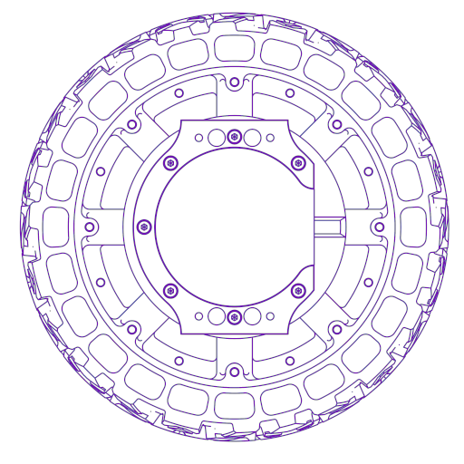
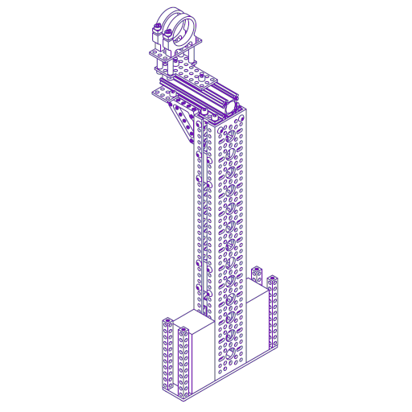
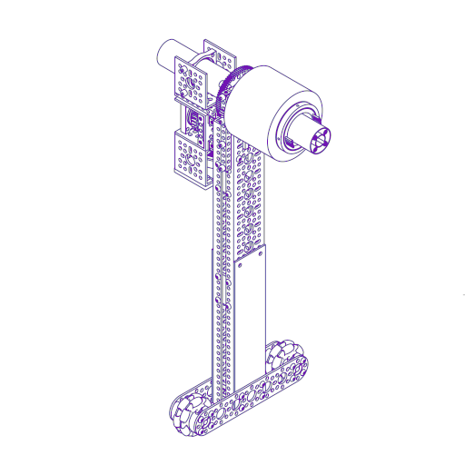
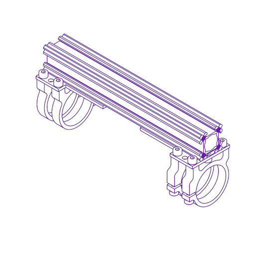
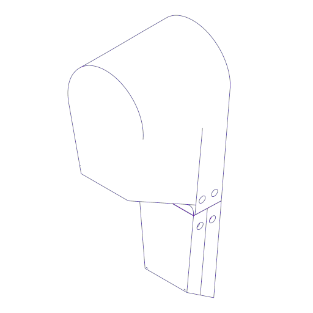
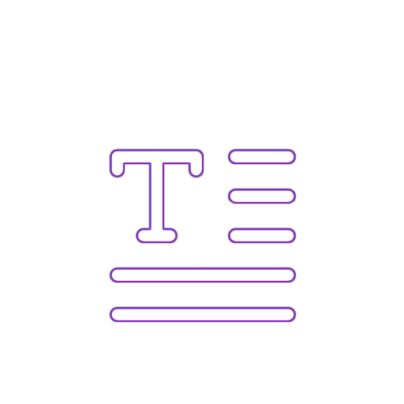

# L1-GT/500 (logistics gyro trolley / 500 height class)

L1-GT is an open, wheeled-biped research platform, developed at UNSW.
 

The platform explores dynamically stable mobility using a two-wheeled base combined with articulated leg structures and a modular upper body. It is inspired by work on wheeled inverted-pendulum robots, in particular Fraunhofer IML’s evoBOT, and projects such as Upkie and Impulse. 

The aim is to provide a practical, buildable system for studying embodied control, learning, and robustness under real-world physical constraints.

---

## project status

- **hardware:** initial design near complete (for v0.1)
- **electronics:** in development
- **software and control:** in development

This repository currently focuses on the mechanical design. Electronics, software, and control will be added as the project matures.

---

## motivation

Many results in robot learning and control rely heavily on simulation fidelity or simplified dynamics. L1-GT is intended as a platform where modelling error, contact, balance, and sensing noise are unavoidable and measurable.

The design emphasises:
- physical embodiment as part of the control problem
- data-efficient learning in a (contact-rich) system, where stability and motion depend continuously on physical interaction with the environment
- simplicity and robustness 

L1-GT is developed as research infrastructure. It is meant to be modified, rebuilt, and extended.

---

## research directions enabled

The platform supports research in areas including:

- whole-body balancing and locomotion under uncertainty  
- hybrid control and learning approaches combining physical models and data  
- morphology and mechanism design as control resources  
- benchmarking classical control, optimisation-based methods, and learning-based approaches on identical hardware  
- embodied intelligence questions where shape, actuation, and sensing materially affect what can be learned

The intent is to support both algorithmic work and studies that explicitly link mechanical design choices to control and learning outcomes.

---

## repository structure

The repository is organised by major components and overall project documentation. Each component has its own documentation, CAD, and bill of materials (click on the images).

### subsystems
| | | |
|---|---|---|
| 
 [**wheels**](hardware/wheels/)
 | 
 [**legs**](hardware/legs/)
 | 
 [**arms**](hardware/arms/)
 | 
| 
 [**bridge**](hardware/bridge/)
 | 
 [**shell**](hardware/shell/)
 | 
 [**docs**](docs/)
 | 

Each hardware component directory typically contains:
- a short README describing the component
- CAD files and drawings
- a BOM with supplier references
- assembly and integration notes
- known issues and limitations

---

## documentation

The main entry point is this [README](docs/).  
Detailed documentation lives alongside the design files in each subdirectory.

---

## licensing

Different artefacts in this repository use different licences:

- **hardware design files (CAD, drawings, mechanical design):**  
  CERN Open Hardware Licence v2.0 – Weakly Reciprocal (CERN-OHL-W)

- **software:**  
  Apache Licence 2.0

- **documentation and original images:**  
  Creative Commons Attribution 4.0 (CC BY 4.0)

See the [`LICENSES/`](LICENSES/) directory for full licence texts.

---

## citation

If you use L1-GT in academic work, please cite it.  
A [`CITATION.cff`](CITATION.cff) file is provided to support standard citation workflows.

---

## related work and inspiration

- Fraunhofer [IML evoBOT ⧉](https://www.iml.fraunhofer.de/en/fields_of_activity/material-flow-systems/iot-and-embedded-systems/evobot.html)
- [Upkie ⧉](https://github.com/upkie/upkie) open-source wheeled biped robot  
- [Impulse ⧉](https://www.aaedmusa.com/projects/impulse) wheeled biped project

These projects influenced the design space explored here, but L1-GT makes its own mechanical and architectural trade-offs.

---

## contributions

Contributions are welcome, but see [`CONTRIBUTING.md`](CONTRIBUTING.md) for details.

---

## acknowledgements

L1-GT is developed and built as a research platform at UNSW.

---

